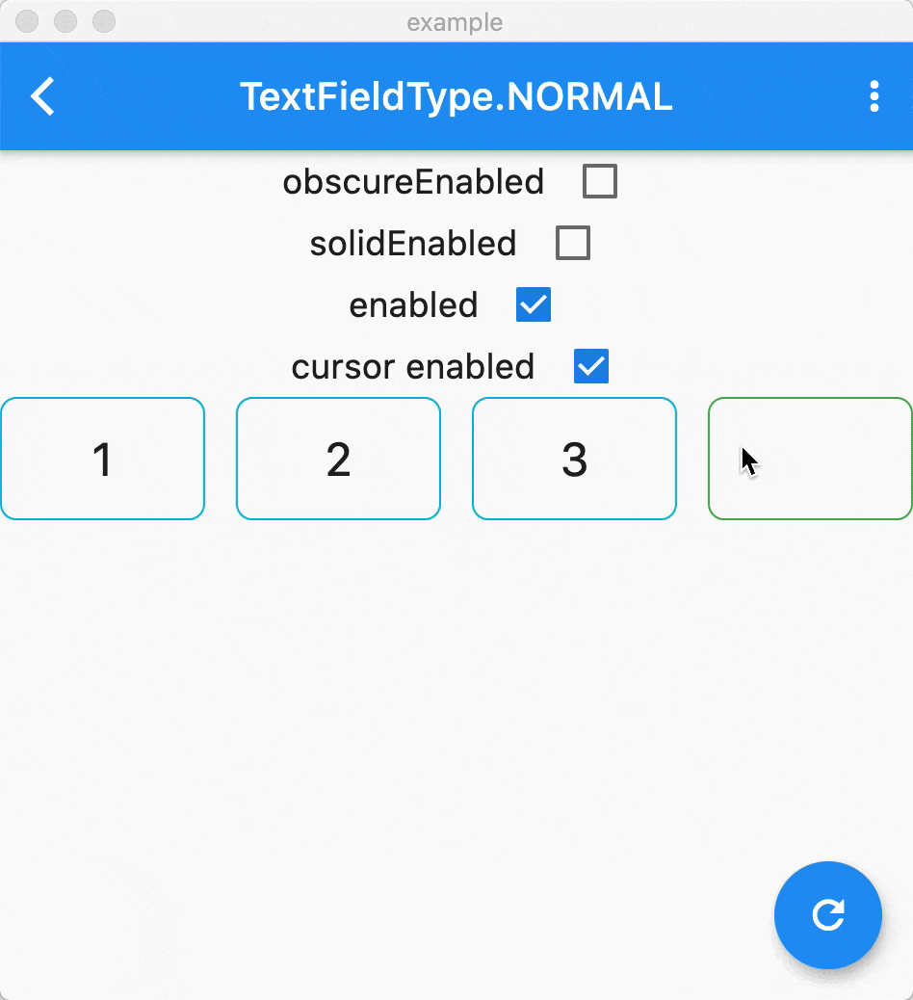
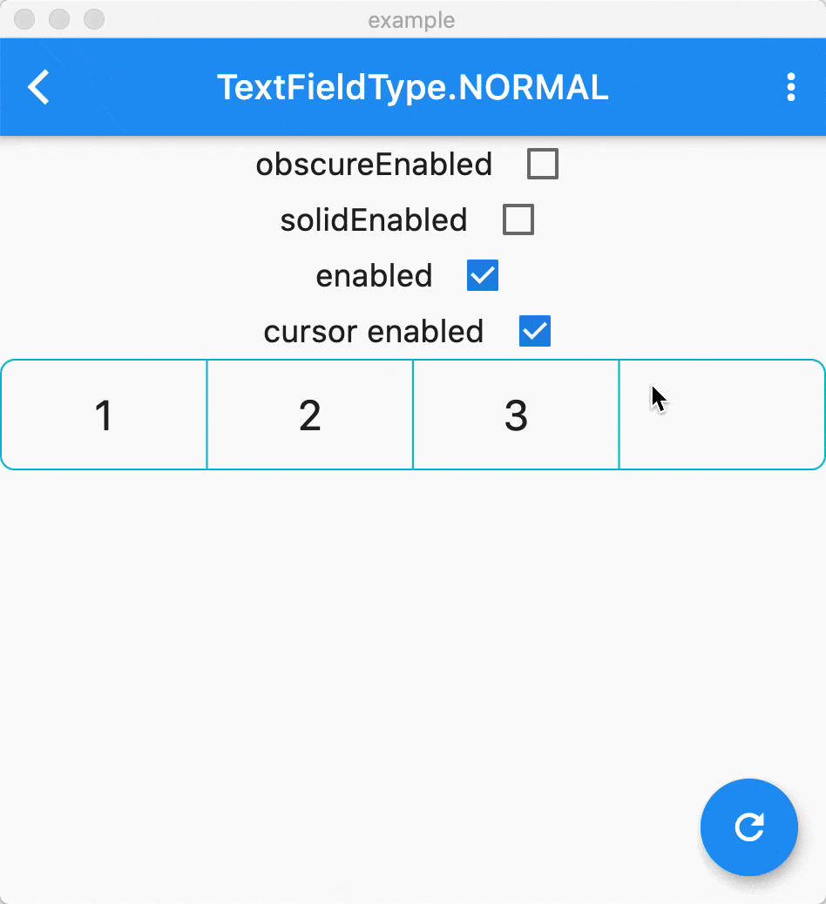

[](https://pub.dartlang.org/packages/pin_input_text_field)

# pin_input_text_field

[中文版点我](./README_CN.md)
PinInputTextField is a TextField widget to help display different style pin.

## Notice after Version 2.0.0
Please set the selection when you set the text programmatically, just like [this](https://github.com/TinoGuo/pin_input_text_field/blob/77dee70a8da25b11eae96f5a03842e5a67174a80/example/lib/main.dart#L81).

I can't set the selection in lib code, because if I did it will cause dead loop in iOS.

**If you have any idea, please make a Pull Request.**

## Example

### Decoration

UnderlineDecoration


BoxLooseDecoration




BoxTightDecoration



## Installing
Install the latest version from [pub](https://pub.dartlang.org/packages/pin_input_text_field).

## Usage

### Attributes
Customizable attributes for PinInputTextField
<table>
    <th>Attribute Name</th>
    <th>Example Value</th>
    <th>Description</th>
    <tr>
        <td>pinLength</td>
        <td>6</td>
        <td>The max length of pin, the default is 6</td>
    </tr>
    <tr>
        <td>onSubmit</td>
        <td>(String pin){}</td>
        <td>The callback will execute when user click done, sometimes is not working in Android.</td>
    </tr>
    <tr>
        <td>decoration</td>
        <td>BoxLooseDecoration</td>
        <td>Decorate the pin, there are 3 inside styles, the default is BoxLooseDecoration</td>
    </tr>
    <tr>
        <td>inputFormatters</td>
        <td>WhitelistingTextInputFormatter.digitsOnly</td>
        <td>Just like TextField's inputFormatter, the default is WhitelistingTextInputFormatter.digitsOnly</td>
    </tr>
    <tr>
        <td>keyboardType</td>
        <td>TextInputType.phone</td>
        <td>Just like TextField's keyboardType, the default is TextInputType.phone</td>
    </tr>
    <tr>
        <td>pinEditingController</td>
        <td>PinEditingController</td>
        <td>Controls the pin being edited. If null, this widget will create its own PinEditingController</td>
    </tr>
    <tr>
        <td>autoFocus</td>
        <td>false</td>
        <td>Same as TextField's autoFocus, the default is false</td>
    </tr>
    <tr>
        <td>focusNode</td>
        <td>FocusNode</td>
        <td>Same as TextField's focusNode</td>
    </tr>
    <tr>
        <td>textInputAction</td>
        <td>TextInputAction.done</td>
        <td>Same as TextField's textInputAction, not working in digit mode.</td>
    </tr>
    <tr>
        <td>enabled</td>
        <td>true</td>
        <td>Same as TextField's enabled, the default is true</td>
    </tr>
</table>

### ObscureStyle

```
/// Determine whether replace [obscureText] with number.
final bool isTextObscure;
/// The display text when [isTextObscure] is true, emoji supported
final String obscureText;
```

## Known Issue

The `PinEditingController` listener will execute more than once when programmatically set text, you can filter some duplicate values in your code. 